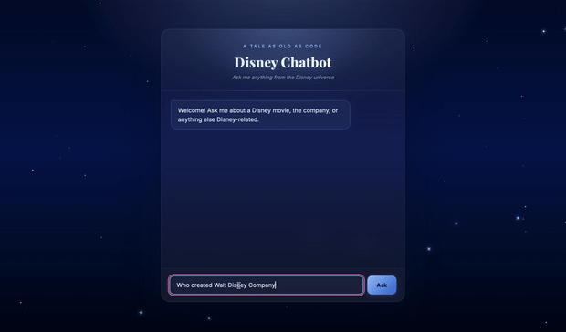

# Disney Chatbot



**Live demo:** [y0zzz.github.io/Disney-Chatbot](https://y0zzz.github.io/Disney-Chatbot/)
**API:** [disney-chatbot-4cgp.onrender.com](https://disney-chatbot-4cgp.onrender.com)
**LLM proxy:** [llm-api](https://github.com/y0zzz/llm-api) — [live](https://llm-api-u9db.onrender.com)

A Q&A chatbot that answers questions about Disney movies and company trivia. A local knowledge base of 68 movies answers instantly; anything else routes through a self-hosted LLM proxy ([llm-api](https://github.com/y0zzz/llm-api)) running Llama 3.1 70B via Cloudflare Workers AI, with a Wikipedia fallback if that's ever unavailable.

## Features

- 68 hardcoded movie facts spanning Disney's Golden Age through recent Pixar releases, with correct sequel/prequel disambiguation (Toy Story 1-4, Frozen/Frozen II, Cars/Cars 2, etc.)
- Company trivia (founding date, founders, CEO, headquarters, stock ticker, major acquisitions)
- Falls back to a self-hosted LLM (Llama 3.1 70B via Cloudflare Workers AI) for open-ended questions, then Wikipedia if that's unreachable
- Fully typed, tested FastAPI backend
- Automated tests + Docker build on every push (GitHub Actions)
- Fully deployed: frontend (GitHub Pages), backend (Render), LLM proxy + Postgres + Redis (Render)

## Architecture

```
GitHub Pages (frontend)
        │
        ▼
Render: Disney Chatbot (FastAPI)
   ├─ Local knowledge base (68 movies + company facts)
   ├─ Wikipedia fallback
   └─ LLM fallback ──▶ Render: llm-api (FastAPI proxy)
                             ├─ Postgres (conversation history)
                             ├─ Redis (caching + rate limiting)
                             └─ Cloudflare Workers AI (Llama 3.1 70B)
```

## Tech stack

- **FastAPI** — web framework
- **Pydantic** — request/response validation
- **httpx** — calls to the llm-api proxy
- **wikipedia-api** — Wikipedia fallback lookups
- **pytest / pytest-asyncio** — test suite
- **Docker** — containerization
- **Render** — hosting for both services, plus managed Postgres and Redis
- **GitHub Pages** — frontend hosting
- **Cloudflare Workers AI** — the actual LLM (Llama 3.1 70B)

## Project structure

```
├── app/
│   ├── main.py            # FastAPI app + routes + CORS
│   ├── disneychatbot.py   # Routing logic
│   ├── disneydata.py      # Local knowledge base (68 movies + company facts)
│   ├── llm_client.py      # llm-api proxy client
│   ├── config.py          # Env var config
│   └── wiki.py            # Wikipedia fallback helper
├── frontend/
│   └── index.html         # Chat UI (single-file HTML/CSS/JS)
├── docs/
│   ├── index.html         # Copy of frontend, served by GitHub Pages
│   └── demo.gif           # Demo recording
├── tests/
│   └── test_main.py
├── .github/workflows/
│   └── ci.yml
├── Dockerfile
├── pytest.ini
├── requirements.txt
└── requirements-dev.txt
```

## Local development

Install dependencies:

```
pip install -r requirements-dev.txt
```

Run the server:

```
uvicorn app.main:app --reload --port 5000
```

Open `frontend/index.html` directly in your browser (update `API_URL` inside it to `http://localhost:5000/chat` for local testing).

**(Optional) enable real LLM answers locally** — requires [llm-api](https://github.com/y0zzz/llm-api) running locally via Docker, or point at the deployed one:

```
export LLM_API_BASE_URL="https://llm-api-u9db.onrender.com"
export LLM_API_KEY="your-key-here"
export LLM_MODEL="llama-3.1-70b"
```

Try it out:

```
curl -X POST http://localhost:5000/chat -H "Content-Type: application/json" -d '{"message": "When was Snow White released?"}'
```

Run with Docker instead:

```
docker build -t disney-chatbot .
docker run -p 5000:5000 disney-chatbot
```

## Running tests

```
pytest -v
```

## API

| Endpoint | Method | Description |
|---|---|---|
| `/health` | GET | Health check |
| `/chat` | POST | Send `{"message": "..."}`, get `{"response": "..."}` back |

## Adding new facts

Add an entry to `app/disneydata.py` — no chatbot logic needs to change:

```
MovieFact("Up", "May 29, 2009", aliases=("up movie", "pixar up"))
```

## Known limitations

- Free-tier hosting means the backend and LLM proxy may take 30-60 seconds to "wake up" after a period of inactivity
- Free Postgres and Redis instances on Render expire/reset periodically; conversation history and response caching are treated as best-effort, not guaranteed

## Roadmap

- [x] Modernize architecture (FastAPI, tests, CI)
- [x] LLM fallback via self-hosted llm-api proxy
- [x] Add a lightweight chat frontend
- [x] Deploy backend (Render) and frontend (GitHub Pages)
- [x] Deploy llm-api publicly (Postgres + Redis + Cloudflare Workers AI)
